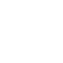

### <h1 align="center">Hi there , I'm Abhi</h1>

---

<picture>
  <source media="(prefers-color-scheme: dark)" srcset="https://github.com/iamabhijeet2003/iamabhijeet2003/blob/output/github-snake-dark.svg" />
  <source media="(prefers-color-scheme: light)" srcset="https://github.com/iamabhijeet2003/iamabhijeet2003/blob/output/github-snake.svg" />
  
</picture>

<h3 align="left">Connect with me:</h3>

  

  

  

<h3 align="left">Languages and Tools I use:</h3>

| **Languages** | **Frameworks/Libraries** | **Databases** | **Tools** | **DevOps/Cloud** |
|---------------|--------------------------|---------------|-----------| -----------|
|  |   |   |  |  |
|  |  |  |  |  | 
|    |  | |  |  |
|  |  | |  |  |
|  |  | |  |  |
|  |  | |
||  | | |

---

## 🛡️ Cybersecurity Skills

| **Vulnerability Scanning & Pentesting** | **Forensics & Analysis** | **Monitoring & Detection** | **Networking & Hardening** |
|-----------------------------------------|---------------------------|-----------------------------|-----------------------------|
| 🔍 Nmap, Nessus, OpenVAS                | 🧩 Autopsy, Belkasoft X   | 📈 Wazuh, Snort             | 🔧 System Hardening         |
| 💥 Metasploit, Burp Suite, SQLmap               | 🧠 DFIR, Android Forensics| 🛡️ OSINT, Wireshark         | 🌐 Firewall Configuration, WAF   |

---

---

 

  

  

